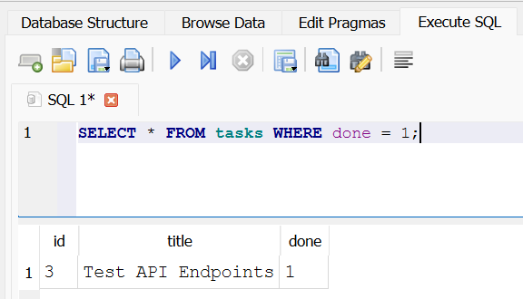
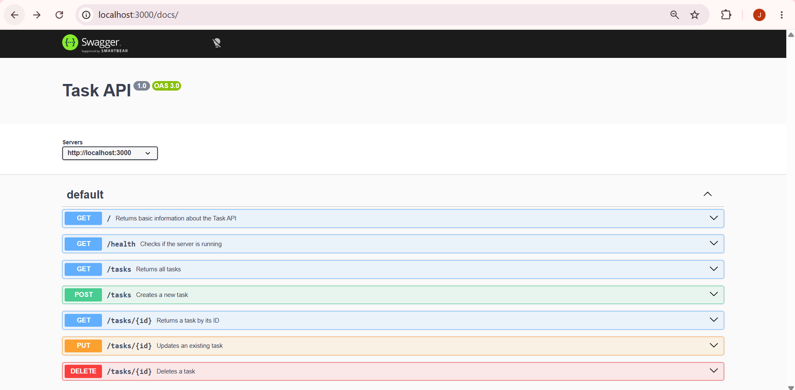
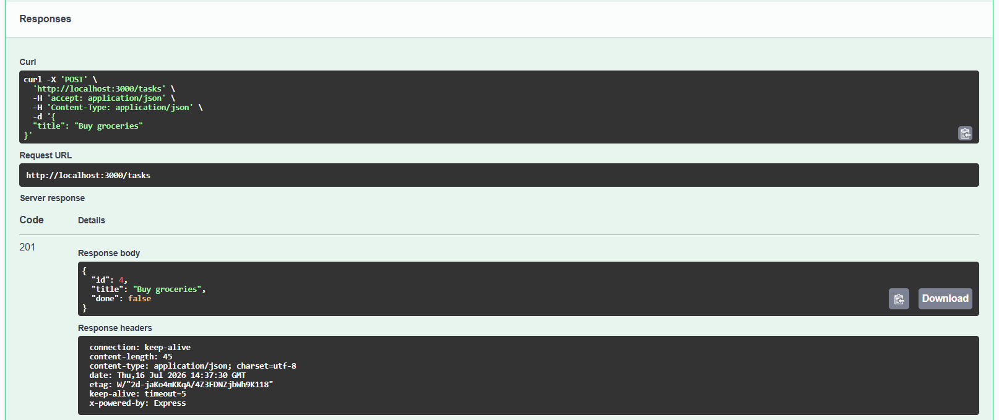

# TaskFlow API


A RESTful Task API built with **Node.js**, **Express.js**, and **SQLite** that supports full CRUD (Create, Read, Update, Delete) operations with persistent database storage. The project demonstrates REST API fundamentals, SQL queries, HTTP methods, request validation, and interactive API documentation using **Swagger UI**.


## Table of Contents

- [Features](#features)
- [Technologies Used](#technologies-used)
- [Installation](#installation)
- [Database](#database)
- [API Endpoints](#api-endpoints)
- [Example curl Request](#example-curl-request)
- [Swagger UI](#swagger-ui)
- [Project Structure](#project-structure)
- [HTTP Status Codes](#http-status-codes)
- [AI Rematch](#ai-rematch)
- [Author](#author)


## Features

- Full CRUD (Create, Read, Update, Delete) operations
- RESTful API endpoints
- SQLite database for persistent task storage
- Automatic database and table creation
- Automatic seeding of **three** example tasks
- SQL-based CRUD operations
- Data persists after server restarts
- JSON request and response handling
- Input validation with proper error handling
- Interactive API documentation using Swagger UI
- Standard HTTP status codes (200, 201, 204, 400, 404)


## Technologies Used

- **Node.js** – JavaScript runtime environment
- **Express.js** – Backend web framework
- **JavaScript (ES6)** – Programming language
- **SQLite** – Lightweight embedded SQL database
- **better-sqlite3** – SQLite driver for Node.js
- **OpenAPI 3.0** – API specification
- **Swagger UI Express** – Interactive API documentation


## Installation

### 1. Clone the repository

```bash
git clone https://github.com/jaweriawaheed19/TaskFlow-API.git
```

### 2. Navigate to the project directory

```bash
cd TaskFlow-API
```

### 3. Install dependencies

```bash
npm install
```

This installs all required project dependencies, including **better-sqlite3**.

### 4. Start the server

```bash
npm start
```

On first startup the application automatically:

- Creates `tasks.db`
- Creates the `tasks` table if it does not already exist
- Seeds three example tasks if the database is empty

The server starts on:

```text
http://localhost:3000
```

Swagger UI is available at:

```text
http://localhost:3000/docs
```

Repository:

```text
https://github.com/jaweriawaheed19/TaskFlow-API
```

## Database

The project uses **SQLite** because it is lightweight, serverless, requires zero configuration, and stores all data in a single file. Unlike the previous in-memory implementation, data now persists even after the server restarts.

### Database File

- The database file is named `tasks.db`.
- It is created automatically the first time the application starts.
- The application automatically creates the `tasks` table if it does not already exist.
- Three example tasks are seeded only when the table is empty.
- The database file is typically added to `.gitignore` so each new clone starts with a fresh database that is created automatically.

## SQLite Database

The screenshot below shows the project database opened in **DB Browser for SQLite**.



## Example SQL Query

The following query was executed during Stage 4 to display all completed tasks.

```sql
SELECT * FROM tasks WHERE done = 1;
```

**Result:** The query returned every task whose `done` value was `1`, allowing only completed tasks to be displayed.


## API Endpoints

| Method | Endpoint | Description | Possible Responses |
|:------:|----------|-------------|--------------------|
| GET | `/` | Returns basic information about the API | 200 OK |
| GET | `/health` | Checks whether the server is running | 200 OK |
| GET | `/tasks` | Returns all tasks | 200 OK |
| GET | `/tasks/{id}` | Returns a task by its ID | 200 OK, 404 Not Found |
| POST | `/tasks` | Creates a new task | 201 Created, 400 Bad Request |
| PUT | `/tasks/{id}` | Updates an existing task | 200 OK, 400 Bad Request, 404 Not Found |
| DELETE | `/tasks/{id}` | Deletes a task | 204 No Content, 404 Not Found |


## Example curl Request

The following command creates a new task.

```bash
curl -i -X POST http://localhost:3000/tasks -H "Content-Type: application/json" -d "{\"title\":\"Buy milk\"}"
```

Successful Response:

```http
HTTP/1.1 201 Created
Content-Type: application/json; charset=utf-8

{
  "id": 4,
  "title": "Buy milk",
  "done": false
}
```


## Swagger UI

Interactive API documentation is available at:

```text
http://localhost:3000/docs
```

### API Overview

The following screenshot shows all available API endpoints documented in Swagger UI.



### Successful POST Request

The following screenshot demonstrates creating a new task using Swagger UI's **Try it out** feature.




## Project Structure

```text
TaskFlow-API/
├── ai-version/
├── screenshots/
│   ├── sqlite-db-browser.png
│   ├── swagger-post-success.png
│   └── swagger-ui-overview.png
├── database.js
├── openapi.json
├── package.json
├── package-lock.json
├── server.js
├── .gitignore
├── README.md
└── tasks.db (created automatically)
```
> *`tasks.db` is created automatically when the application starts and is usually ignored by Git.*


## HTTP Status Codes

| Status Code | Meaning |
|-------------|---------|
| **200 OK** | Request completed successfully |
| **201 Created** | A new task was created successfully |
| **204 No Content** | A task was deleted successfully |
| **400 Bad Request** | The request was invalid (e.g., missing title or no fields to update) |
| **404 Not Found** | The requested task does not exist |


## AI Rematch

To evaluate how well AI could generate the same backend application, I wrote my own prompt and asked an AI assistant to build the Task API from scratch. The AI-generated implementation was kept in a separate `ai-version/` folder so that my original hand-built implementation remained unchanged.


## Original Prompt

```text
Build a RESTful Task Management API using Node.js and Express.js.

Requirements:

- Store tasks in an in-memory array (no database or file storage).
- Each task should have:
  - id (integer)
  - title (string)
  - done (boolean)

Implement the following endpoints:

1. GET /
   - Return API information including name, version, and available endpoints.

2. GET /health
   - Return a JSON response indicating the server is running.

3. GET /tasks
   - Return all tasks.

4. GET /tasks/:id
   - Return the requested task.
   - If the task does not exist, return:
     - HTTP 404
     - JSON: { "error": "Task <id> not found" }

5. POST /tasks
   - Create a new task.
   - The request body must contain a non-empty "title".
   - New tasks should default to done: false.
   - Return HTTP 201.
   - If title is missing or empty, return HTTP 400 with a JSON error.

6. PUT /tasks/:id
   - Allow updating title and/or done.
   - Return HTTP 200 with the updated task.
   - Return HTTP 400 if no valid fields are provided.
   - Return HTTP 404 if the task does not exist.

7. DELETE /tasks/:id
   - Delete a task.
   - Return HTTP 204.
   - Return HTTP 404 if the task does not exist.

Additional requirements:

- Use express.json().
- Use proper REST API status codes.
- Return JSON responses only.
- Create an OpenAPI 3.0 specification.
- Serve Swagger UI at /docs using swagger-ui-express.
- Organize the code clearly and keep it beginner-friendly.
```


## AI vs Me

### What the AI Did Better

- Generated a modular project structure by separating routing, data storage, and server configuration into multiple files, improving maintainability and scalability.
- Created a more detailed OpenAPI specification with reusable schemas and better endpoint organization, resulting in a cleaner Swagger UI.
- Used `process.env.PORT || 3000`, allowing the server to run on different ports without modifying the source code.
- Added extra information such as `uptime` and `timestamp` to the `/health` endpoint.

### What the AI Got Wrong or Quietly Ignored

- Renamed the API from **Task API** to **Task Management API**, even though my prompt did not ask for a different name.
- Returned additional fields (`uptime` and `timestamp`) in the `/health` endpoint instead of the simple `{ "status": "ok" }` response used in my implementation.
- Initialized the API with a different set of sample tasks. Since my prompt only specified having an in-memory task list and did not define the exact sample data, the AI made its own assumptions.
- Added implementation details and extra features that were not explicitly requested, making the solution different from the intended minimal specification.

### What My Prompt Forgot to Specify

While comparing both implementations, I realized that my prompt left several implementation details open to interpretation:

- The exact API name.
- The exact response format for the `/health` endpoint.
- Whether the project should use a single-file or modular structure.
- The exact sample task data.
- The desired level of detail for the OpenAPI documentation.

Because these details were not specified, the AI made reasonable implementation decisions that differed from my hand-built version.


## Improved Prompt

```text
Build a RESTful Task API using Node.js and Express.js.

Requirements:

General
- Name the API exactly "Task API".
- Keep the implementation beginner-friendly.
- Store tasks in an in-memory array only. Do not use a database or file storage.
- Initialize the API with exactly three sample tasks.
- Use express.json() middleware.
- Return JSON responses only.

Endpoints

GET /
- Return the API name, version and available endpoints.

GET /health
- Return exactly:
{
  "status": "ok"
}

GET /tasks
- Return all tasks.
- Status code: 200.

GET /tasks/:id
- Return the requested task.
- If the task does not exist, return HTTP 404 with:
{
  "error": "Task <id> not found"
}

POST /tasks
- Accept a JSON body containing a non-empty "title".
- New tasks must default to done: false.
- Return HTTP 201.
- Missing or empty title must return HTTP 400 with a JSON error.

PUT /tasks/:id
- Allow updating title and/or done.
- Return HTTP 200 with the updated task.
- Return HTTP 400 if no valid fields are supplied.
- Return HTTP 404 if the task does not exist.

DELETE /tasks/:id
- Delete the requested task.
- Return HTTP 204.
- Return HTTP 404 if the task does not exist.

Swagger
- Create an OpenAPI 3.0 specification.
- Serve Swagger UI at /docs using swagger-ui-express.
- Keep the implementation close to the requested functionality without adding extra response fields or unnecessary features.
```


## Rematch Result

This exercise demonstrated that AI-generated code is only as good as the specification it receives. Building the project manually first allowed me to review the generated code critically, identify AI assumptions, and improve my prompt to produce a solution that more closely matched my intended implementation.


## Author

*Jaweria Waheed Satti*

- Student – BS Computer Science  
- [LinkedIn](https://www.linkedin.com/in/jaweriasatti19)  
- [Email](mailto:jaweriasatti19@gmail.com)
